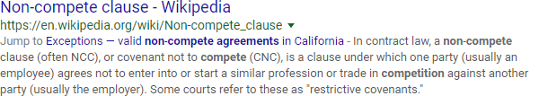
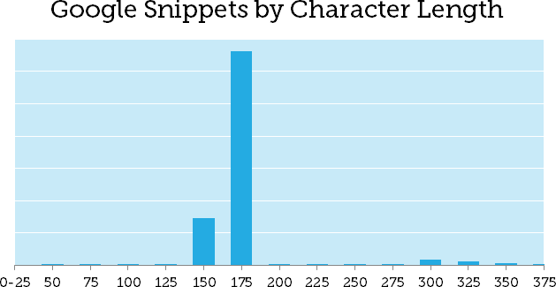
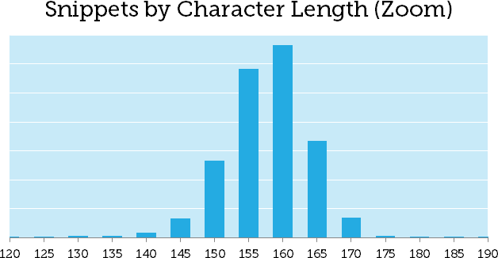

# làm sao để viết meta description trong một thế giới thay đổi liên tục (đưọc biết đến như là Google ban tặng- Google lại mang đi)

> **Tóm lược**: vào giữa tháng 5 năm 2018,  Google đã quay trở lại với các đ ọan trích trưng bày ngắn hơn. Dữ liệu của  chúng tôi cho  r arằng các  thay đổi đang lan rộng và  phần lớn các meta description đang bị cắt ngắn hơn, về mức 155-160 kí tự

Qua trở lại tháng 12, google đã tạo ra một shay đổi quan trọng  về cách mà họ trưng bày  các search sniippet, nghiên cứ của chúng tôi cho thấy rất nhiều snippet quá 300 kí tự
. Trong vòng một tuần, có vẻ họ đã rooled back thay đổi đó( Danny Sullivan  đã x[ác nhận](https://twitter.com/dannysullivan/status/996065145443893249) điều này trên twitter vào ngày 14/5). Và câu hỏi hiển nhiên là: Giới hạn mới là gì? -  nó có thể  khiến bạn tự vấn rằng làm sao để đối phó  khi các nguyên  tắc cứ kiên tục thay đổi . Không ai trong chúng ta có quả cầu tieen tri, nhưng tôi  sẽ  cosos gắng trar lời cả hai câu hỏi dựa trên những gì chúng tôi biết cho đến ngày hôm nay.

## Dối trá, dối trá bẩn thỉu và số liệu thống kê .
Tôi đã kéo về toàn bộ các đoạn trích tìm kiếm có sẵn từ  MozCast 10 ( page 1  google  tả về cho 10000 từ khóa). Tập dữ dữ liệu đó  được chúng tôi thu thập hàng này và có một lịch sử phong phú. Đã có 89,383 đoạn trích đưọc hiển thị trên tập dữ liệu đó vào sáng 15/5

Tôi sẽ nói với bạn điều này: trên toàn bộ các tập dữ liệu , độ  dài ngắn nhất là 6 kí tự , dài nhất là 386 kí tự  và trung bình là 159. Điều này không thực sự hữu ích  vì một vài lí do. Thứ nhất,  khyên bạn viết 1  meta description tuwf 6 đến 386 không  phải là một lời khuyên hữu dụng. thứ 2, chúng ta đang  đối phó với rất nhiều trường hợp , ví dụ với từ khóa USMC:   

Marine Corps Community Services  là một tổ chức tuyệt vời, nhưng rất tiếc khi phải thông báo rằng meta description của họ trong thực tế là 'apple'( tôi đoán là google đã thêm vào), đay là đoạn trích khi search của hàng 'Younkers':  

Bỏ qua sựu nhầm lẫn đa thương hiệu nghiệm trọng của họ. Tôi nghĩ tất cả chúng ta đều có thể đồng ý rằng "BER Meta TAG1" không tối ưu. Nếu trường hợp này có dạy bạn điều gì, thì đó là vè những gì không nên làm. Vậy với trường hợp ngưọc lại, đây là đoạn trích với 386 kí tự khi tìm kiếm 'non-compete agreement':  

  

Lưu ý rằng cụm từ "Jump to Exceptions" và các liên kết ở đầu. Những thứ này đã được thêm vào bởi Google, vì vậy thật khó để nói cái gì đếm số ký tự và những gì không. Dưới đây là ví dụ mà nếu không thêm phần bổ sung thì có đúng 370 ký tự, từ tìm kiếm "the Hunger Games books":  

  

Vậy chúng ta biết đoạn trích hơn như vậy vẫn còn tồn tại. Lưu ý rằng cả hai đoạn mã này đều có nguồn gốc từ Wikipedia, là ngoại lệ đối với nhiều quy tắc SEO. Liệu những mô tả dài này chỉ là các trường hợp nhỏ? Nhìn vào gía trị trung bình không thực sự cho ta biết điều đó.  

## Bức tranh toàn cảnh, phần 1
Đôi khi chúng ta phải để cho những con số tự nói về chính nó, với một hút nắn sửa.  Hãy xem xét tất cả các đoạn trích đã được cắt (kết thúc bằng "...") và xóa kết quả video (chúng tôi biết từ nghiên cứu trước đây rằng các đoạn trích này ngắn hơn một chút). Điều này cho ta 42,863 đoạn trích (dưới một nửa bộ dữ liệu của chúng tôi). Dưới đây là đồ thị của tất cả các độ dài bị cắt, được thu thập thành 25 nhóm ký tự (0-25, 26-50, v.v.):  

  

Nhìn có vẻ rất khác với dữ liệu của chúng tôi vào tháng 12 năm trước, và được phân cụm rõ ràng trong phạm vi ký tự 150-175. Chúng tôi thấy một vài đoạn trích hiển thị của Google bị cắt sau khoảng 300 kí tự, nhưng những đoạn mã này bị thu hẹp bởi các lần cắt ngắn hơn.

## Bức tranh toàn cảnh, phần 2
Rõ ràng, có rất nhiều thứ xảy ra trong phạm vi 125-175 ký tự đó, vì vậy, hãy phóng to và nhìn vào phần giữa của phân bố tần suất, chia thành các nhóm nhỏ hơn gồm 5 ký tự:  

  

Chúng ta có thể thấy rõ ràng rằng phần lớn các lần cắt giảm xảy ra trong phạm vi ký tự 145-165. Trước tháng 10, các hướng dẫn trước đây cho meta description giữ chúng dưới 155 ký tự, do đó, có vẻ như google đã nhiều hoặc ít là đã quay lại với các quy tắc cũ.

Hãy nhớ rằng Google sử dụng phông chữ theo tỷ lệ, vì vậy không có giới hạn ký tự chính xác. Một số người đã đưa ra giả thuyết một giới hạn chiều rộng pixel, giống như với thẻ tiêu đề, nhưng tôi thấy rằng khó khăn hơn để ghim xuống với các đoạn trích nhiều dòng (tình huống thậm chí còn khó khăn hơn trên kết quả di động). Thực tế, cũng khó để viết tới giới hạn pixel. Các dữ liệu cho thấy xấp xỉ 155 ký tự là hợp lý.

## To the Wayback Machine... ?!
Chúng ta có nên quay trở lại với 155 ký tự không? Nếu bạn đã viết meta description dài hơn, bạn có nên bỏ đi và bắt đầu lại? Sự thật đơn giản là không ai trong chúng ta biết điều gì sẽ xảy ra vào tuần tới. Theo cách nhìn nhận của tôi, chúng ta có bốn lựa chọn khả thi:

### Hãy để Google xử lý nó
Một số trang web không có meta descriptions. Wikipedia là một trong số chúng. Bây giờ, sự hiểu biết của Google về nội dung của Wikipedia sâu sắc hơn nhiều so với hầu hết các trang web (một phần, nhờ Wikidata), nhưng nhiều trang web làm tốt mà không có thẻ. Nếu lựa chọn của bạn là viết thẻ không hợp lệ, lặp lại hoặc để trống, thì tôi sẽ nói để trống chúng và để Google sắp xếp.

### Hãy để cứ để nó bị cắt
Bạn chỉ có thể viết với độ dài mà bạn nghĩ là lý tưởng cho bất kỳ trang nào (trong suy luận) và nếu đoạn trích bị cắt, đừng lo lắng về nó. Có thể dấu ba chấm (...) là một mẹo. Tôi đang nửa đàu nửa thật, nhưng thực tế là việc cắt giảm không phải là nụ hôn của thần chết. Một mô tả hay nên lôi kéo mọi người muốn đọc thêm.

### Cắt tất cả mọi thứ ở 155 ký tự
Bạn có thể quay trở lại và không thương tiếc hack tất cả các công việc của bạn trở về 155 ký tự. Tôi nghĩ rằng điều này thường sẽ mất nhiều thời gian và có thể dẫn đến các đoạn tìm kiếm thậm chí tệ hơn. Nếu bạn muốn viết lại meta description ngắn hơn cho các trang quan trọng nhất của mình, điều đó hoàn toàn hợp lý, nhưng hãy nhớ rằng một số kết quả vẫn hiển thị các đoạn mã dài hơn và tình trạng này sẽ tiếp tục xuất hiện.

### Viết mô tả phù hợp với độ dài
Có thể viết mô tả hoạt động tốt ở cả hai độ dài không? Tôi cho rằng là có nếu ta dành ra sự quan tâm và kèm kế hoạch. Tôi nghĩ sẽ không nhất thiết phải đề xuất điều này cho mỗi trang, nhưng có lẽ cũng có cách để có chiếc bánh và ăn ít nhất một nửa của nó, ...

## Cách tiếp cận 150/150
Tôi đã bị ám ảnh một chút với kiểu viết "[kim tự tháp ngược](https://moz.com/blog/content-for-answers-inverted-pyramid)"gần đây. Đây là một phong cách báo chí nơi bạn bắt đầu với sự dẫn đầu hoặc tóm tắt điểm chính của bạn và sau đó chia nhỏ chi tiết, dữ liệu và ngữ cảnh. Mặc dù cách tiếp cận này rất phù hợp với web, nguồn gốc của nó xuất phát từ các giới hạn bố cục trong bản in. Bạn không bao giờ biết khi nào trình soạn thảo của bạn sẽ phải cắt ngắn bài viết của bạn để vừa với không gian sẵn có, do đó, phong cách kim tự tháp ngược giúp đảm bảo rằng phần quan trọng nhất thường được gĩư lại.

Điều gì sẽ xảy ra nếu chúng tôi thực hiện phương pháp này với meta descriptions? Nói cách khác, tại sao không viết 150 ký tự "dẫn" tóm tắt trang, và sau đó thêm 150 ký tự chi tiết hữu ích nhưng ít cần thiết (khi thêm chi tiết đó có ý nghĩa và cung cấp giá trị)? 150/150 không phải là số ma thuật - thậm chí bạn có thể làm 100/100 hoặc 100/200. Điều quan trọng là đảm bảo rằng văn bản trước khi cắt có thể tự đứng vững.

Hãy suy nghĩ về nó một chút giống như một quảng cáo, với hai dòng riêng biệt của bản sao. Hãy lấy bài đăng trên blog này:
### Dòng 1 (145 char)
Vào tháng 12, chúng tôi đã thông báo rằng Google đã tăng đoạn trích tìm kiếm lên hơn 300 ký tự. Thật không may, có vẻ như các quy tắc đã thay đổi một lần nữa.
### Dòng 2 (122 chars.)
Theo nghiên cứu mới của chúng tôi (tháng 5 năm 2018), giới hạn này là 155-160 ký tự. SEO sẽ thích ứng với những thay đổi này như thế nào?  

Dòng 1 có phiên bản ngắn của câu chuyện và hy vọng người tìm kiếm biết rằng họ đang đi đúng hướng. Dòng 2 đi sâu vào một vài chi tiết và cho đi đủ dữ liệu (hy vọng) là hấp dẫn. Nếu Google sử dụng đủ dài mô tả, nó sẽ hoạt động tốt, nhưng nếu không, chúng ta không nên tệ hơn.

## Bạn có nên bận tâm không?

Liệu điều này có đáng quan tâm? Tôi nghĩ rằng viết mô tả hiệu quả thu hút khách truy cập tìm kiếm vẫn rất quan trọng, theo lý thuyết (và điều này ảnh hưởng gián tiếp đến xếp hạng), nhưng như bạn có thể thấy bạn hoàn toàn có thể viết tốt trong giới hạn 155 ký tự. Chúng ta cũng phải đối mặt với thực tế rằng Google dường như đang viết lại các mô tả ngày càng nhiều. Điều này rất khó để đo lường, vì nhiều lần viết lại là một phần, nhưng không có gì đảm bảo rằng meta description của bạn sẽ được sử dụng như khi được bạn viết.  

Có cách nào để biết khi nào một đoạn trích dài hơn (300 ký tự) vẫn sẽ được sử dụng? Một số SEO đã đưa ra giả thuyết một liên kết giữa các đoạn mã dài hơn và các đoạn trích nổi bật ở đầu trang. Trong tập dữ liệu tổng thể của chúng tôi, 13,3% trong tổng số SERP có đoạn trích nổi bật. Nếu chúng ta chỉ xem SẺP với độ dài đoạn trích hiển thị tối đa là 160 ký tự (nghĩa là không có kết quả nào dài hơn 160 ký tự), thì đoạn mã nổi bật xuất hiện là 11,4%. Nếu chúng ta xem SERP với ít nhất một đoạn trích hiển thị trên 300 ký tự, các đoạn trích nổi bật xảy ra với tỷ lệ 41,8%. Trong khi tập dữ liệu thứ hai là khá nhỏ, nó là một sự khác biệt nổi bật. Dường như có một sự liên giữa khả năng trích xuất câu trả lời của tôi dưới dạng đoạn trích nổi bật và khả năng hoặc sự sẵn sàng của họ để hiển thị các đoạn trích tìm kiếm dài hơn. Tuy nhiên, trong nhiều trường hợp, các đoạn trích dài hơn này được viết lại hoặc được lấy trực tiếp từ trang, vì vậy ngay cả khi đó, không có gì đảm bảo rằng Google sẽ sử dụng meta description dài hơn của bạn.

Hiện tại, có vẻ như hướng dẫn về việc sử dụng 155 ký tự đang trở lại. Nếu bạn đã tăng một số meta description của mình, tôi không nghĩ có bất kỳ lý do gì để hoảng sợ. Có thể việc viết lại các mô tả quá dài trên các trang quan trọng sẽ có ý nghĩa, đặc biệt nếu các phần cắt giảm dẫn đến kết quả xấu. Nếu bạn chọn viết lại một số trong số chúng, hãy xem xét cách tiếp cận 150/150 - ít nhất thì bạn sẽ được kiểm chứng một chút trong tương lai.

